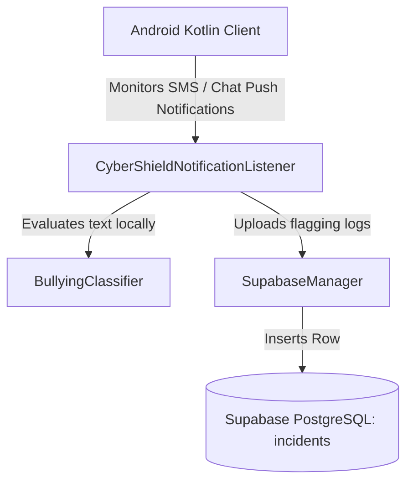

# Backend Technology & Architecture Inventory

This document inventories the backend components and services utilized by the CyberShield application for real-time messaging safety audits and reporting.

## 1. Technology Stack
* **Language/Platform**: Kotlin (JVM target 17) / Android SDK.
* **Backend Database & Storage**: Supabase (PostgreSQL with built-in Postgrest REST API wrapper).
* **Serverless Functions**: Supabase Edge Functions (Deno Runtime running TypeScript/JavaScript).
* **Communication Clients**: OkHttp 4.x / Ktor Client / Supabase-kt client SDK.

## 2. Architecture Diagram

## 3. Database Schema
The SQL database contains an `incidents` table with the following layout:
* **id**: UUID (Primary Key, Default generated)
* **user_id**: UUID (Foreign Key mapping to `auth.users`)
* **timestamp**: BIGINT
* **sender**: TEXT
* **message_content**: TEXT
* **source_app**: TEXT
* **severity**: VARCHAR(30)
* **reason**: TEXT

## 4. API Endpoints
* **Auth Endpoints**:
  * `/auth/v1/signup` (POST)
  * `/auth/v1/token?grant_type=password` (POST)
* **Database Endpoints**:
  * `/rest/v1/incidents` (POST/GET)
* **Edge Functions**:
  * `/functions/v1/classify-message` (POST)
